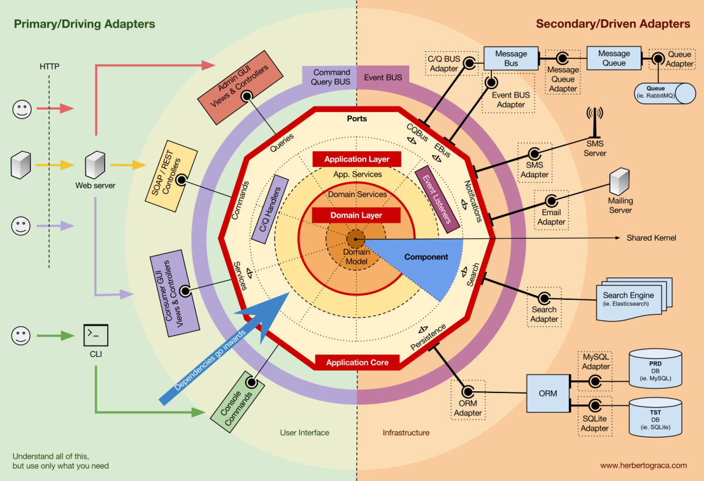

# notifications

## User guide

Prerequisites to run locally:

* `JAVA_HOME=<path to your jdk>/jdk22/..`
* maven
* make sure your `~/.m2/settings.xml` has GitHub user and token with access to read GitHub packages

```xml

<settings xmlns="http://maven.apache.org/SETTINGS/1.0.0"
          xmlns:xsi="http://www.w3.org/2001/XMLSchema-instance"
          xsi:schemaLocation="http://maven.apache.org/SETTINGS/1.0.0
                      http://maven.apache.org/xsd/settings-1.0.0.xsd">

    <activeProfiles>
        <activeProfile>github</activeProfile>
    </activeProfiles>
    <profiles>
        <profile>
            <id>github</id>
            <repositories>
                <repository>
                    <id>central</id>
                    <url>https://repo1.maven.org/maven2</url>
                </repository>
                <repository>
                    <id>github</id>
                    <url>https://maven.pkg.github.com/memoria-io/*</url>
                    <snapshots>
                        <enabled>true</enabled>
                    </snapshots>
                </repository>
            </repositories>
        </profile>
    </profiles>

    <servers>
        <server>
            <id>github</id>
            <username> <!-- Add your Github username here --> </username>
            <password> <!-- Add your Github read packages token here --> </password>
        </server>
    </servers>
</settings>
```
Then
```bash
mvn package
docker build . -t notifications
docker run -p9000:9000 -it notifications
```


## Developer guide

Based on hexagonal architecture, here's how modules are mapped:

* app (entrypoint and run perspective)
* core
    * domain layer
        * model, service
    * application layer
* infra (infrastructure)
    * in -> primary/driving adapters
    * out -> secondary/driven adapters



### OpenAPI

The API Schema is in [index.yaml](infra/src/main/resources/index.yaml)

